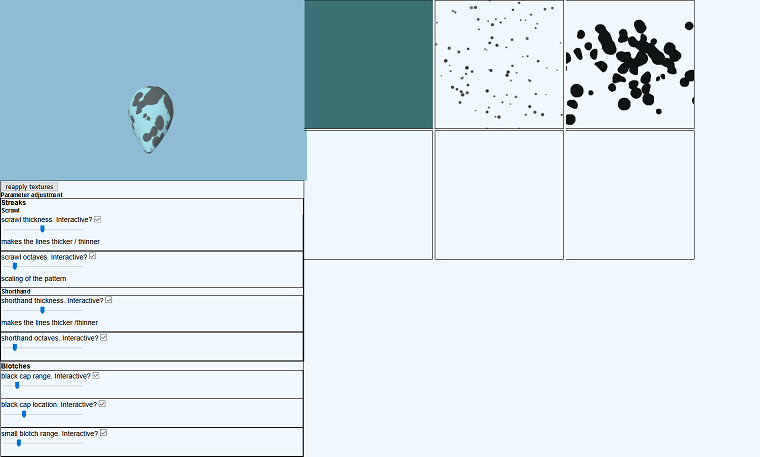

# virtual-eggs
Dissertation project for recreating diverse Guillemot egg patterns in a web application. Users are able to change the parameters that influence the way patterns are made.
Using THREE.js for a 3D view and spatial statistics, kriging for texture generation. 

Patterns that vary in shape, size and colour: 


A simple UI for adjusting the pattern parameters:




## To run
While in the project's root directory
```bash
npm install && node app.js.
```

Access the application via localhost:3000/dissertation.
